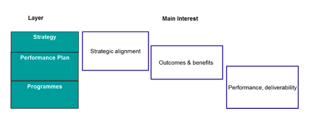

# Portfolio Governance

**[Summary](#summary)** | **[Typical-decisons-required](#Typical-decisons-required)** |
 
# Summary

Good governance empowers effective decision making. Organisation can coach their staff and show how to apply this model on a day-to-day basis to the actual portfolio management of projects. This will enable Organisation to objectively prioritise the portfolio and feed meaningful information into its leadership. Through this refreshed governance model, the leadership will understand what decisions are required upon the project issues that have been escalated via a rule. This will include Change Control and Assurance Boards under sub-Portfolio Managers to include Change Requests, Risk, Contingency, and Delivery Assurance.

# Strategy 
 Leaders make strategy visible through their actions i.e. at the same time as the above, these leaders will make their strategic priorities more visible to the organisation to better align projects to organisational objectives and identify benefits. To achieve this future model, Organisation can review organisational capabilities against the P3M3 model and set a clear roadmap for Organisation delivery.

# Typical-decisions-required

- can I manage Portfolio without a Portfolio Office (quite possibly yes)

-how do we round out these specific capabilities with behavioural, attitudinal, and governance components?

- Is new project-management and portfolio capability a priority for the business this year?

- how will the Leadership balance management attention and funding across  the project-management and portfolio areas? 
- Which of these basic capabilities are needed, and which enhanced capabilities? 
For the capabilities selected, which are only required in the long term ?