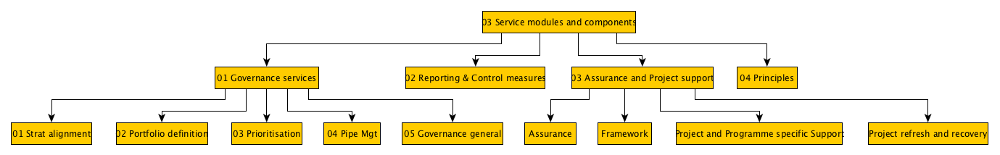

# Acme: A research framework for reinforcement learning

**[Purpose](#Purpose)** | **[Motivation](#Motivation)** |

# Purpose

Either: 

- Have a body of Portfolio services that everyone can understand and use

Or 
- Deploy small modules of portfolio services, without having to build and maintain an integrated framework 

# Motivation 

A simple and deployable portfolio management services framework allows project staff to focus on delivering projects. 

**Typical internal pain points**

- Content is hard to find, patchy, and out of date

- Portfolio schemes are set up either from scratch or copy and paste. 

- Portfolio framework does not improve from year to year

- There is no standard way of delivering a portfolio service

- There is a lot of wasted time, year on year, arising from the argument as to what exactly should be in the full project framework

**What success looks like internally**

1. Portfolio framework is complete and straightforward to access 

1. Portfolio management tasks can be planned and estimated in a consistent way

1. Each portfolio tasks starts from an inherited service descriptions, task plan, and tool or template.

# Artefacts

- Portfolio Service modules	within a Catalogue

- Each portfolio instance will be a variant /fork of the relevant modules. 

# Quick-start

(optional in brackets)
1. (Create Github account) and (download Github Desktop)
1. Fork this code repository (Project Frameworks)
1. Clone this fork onto your PC.
1. Remove the modules (subfolders) you don't need within this folder (P3M-content-first-framework)
1. Add in your own modules and modify the existing modules to suit your purposes
1. Periodically sync with Github
1. (Edit the Folder-structure.graphml to reflect your modified module structure - most easily in YEd)
1. (When ready to deploy to your team, allow them to fork your Portfolio framework

# How to open and view GraphMl in Neo4j

To Open this in Neo4j: 

CALL apoc.import.graphml("https://raw.githubusercontent.com/lawrencerowland/Data-Model-for-Project-Frameworks/master/P3M-content-first-framework/Folder-structure.graphml", {})

Run this query to give the nodes a folder label. 

MATCH (n)
SET n:folder
RETURN n.Node, labels(n) AS labels

# Why use Open Source Tools for Project Services ?

The idea is that by using a tool within one of your existing work-flows, you will be able to do your job more quickly, accurately and effectively. I use these tools in four main ways:

- better implementing a project capability improvement at the client

- assisting my client to operate her portfolio , programme or project more effectively

- linking up service offerings with general and specific client challenges for sales

- recording, testing, repeating, improving and sharing our own work-flows and methods.

I also find that it helps me understand better what my own current work-flow actually is, even as I try to improve it.

# Technology Radar for Project services 

This is a technology radar for project and portfolio teams. It considers the platforms, tools, languages and frameworks, and techniques that are most relevant to project management. This version is 2019, and we will post updates here. 

Find interactive version [here](https://radar.thoughtworks.com/?sheetId=https%3A%2F%2Fdocs.google.com%2Fspreadsheets%2Fd%2F1G3bgKo60BvGuxleWsyqGLeH-aP3SGsobeUpozNzTqls%2Fedit%3Fusp%3Dsharing) (Open in Edge or Chrome, and wait a few seconds whilst it builds):

The solution descriptions are attached as a separate pdf.
This radar considers the platforms, tools, languages and frameworks, and techniques that are most relevant to improving the way that we deliver project management services to our clients. 

A second technology radar for Large Digital programmes that  is planned [x](xxx)

This radar can be updated each quarter. 

You can create your own radar at ThoughtWorks [here](https://www.thoughtworks.com/radar/byor)

# Our Technology radar 2019

Platforms
ADOPT
1. Orange data-mining

3. Microsoft EPM

4. Salesforce (Kimble)

5. Sharepoint

6. Microsoft 365

TRIAL
2. KNIME

Tools

ADOPT
7. Yworks

8. Devonthink iOS

TRIAL
9. Watson news

14. Loopy.io

15. Power BI

ASSESS
11. Infranodus

12. Flourish plots

HOLD
10. Raw graphs

13. ListView

Languages and frameworks

ADOPT
22. Digital Practitioner

TRIAL
17. KBPEDIA

ASSESS
16. Protégé

21. Wardley Mapping

HOLD
18. Google GDELT

19. YAGO knowledge graph

20. Triz

Techniques

TRIAL
24. Modular text files

25. Text2Folders

26. Directory List and Print

HOLD
23. Tagging

Platforms
ADOPT

1. Orange data-mining
Visual programming to train models on client data. You can create workflows to import, transform and output data and views. You may wish to send the results to a separate visualisation package. There are libraries for Data Handling, Simple visualisation, Natural language processing, as well as several libraries for machine learning. Once you create a workflow, you can share it with others, and because data files are kept separately to calculations	<https://orange.biolab.si/>

Microsoft EPM
A valuable way of structuring and scheduling projects. It is important to understand its features relative to services like Planview.

Salesforce (Kimble)
A key tool for understanding engagement performance.This could be used to segment the market, and understand prices for different service offerings. In the long term it would be the main generator of data for using machine learning models to understand what sort of sales and what sort of assignments succeed.

Sharepoint
many organisations have Sharepoint but don't really use it. By starting with a restricted vocabulary to apply to existing documents, one can start to structure this data for use. Also use Workflow features

Microsoft 365
A good platform that could nudge a team towards considering whether to go towards Microsoft Azure in the long term, once decided which features of a data science / ML platform are valuable.

TRIAL
2. KNIME
Visual programming to build and simulate models on client data. This is a more heavy-weight platform than Orange, although a little harder to use. It is on the leader quadrant of Gartner's 2019 Data science platforms. There are a lot of workflows that come uploaded <https://www.knime.com>

Tools
ADOPT
Yworks
Represent data intuitively with a view tailored to the User. There are many different templates for different types of network and tree. It takes a minute to create a network from your spreadsheet. There is also web version which has most features, although it is a little clunkier for navigation, and you can only start from a graph not a spreadsheet. <https://www.yworks.com/products/yed>

Devonthink iOS
Document database with tagging and search and OCR. iOS only, although there are many comparable systems in Windows (ask LR)
<https://www.devontechnologies.com/products/devonthink/devonthink-to-go.html>

TRIAL
Watson news
Use the knowledge graphs of others to find key suppliers, individuals and themes surrounding a client <http://news-explorer.mybluemix.net/>

Loopy.io
A quick visualisation and thinking tool for sketching out situations where there are feedback loops and other system effects. I have found this product useful for helping the client to understand which problem to focus on. <https://ncase.me/loopy/>

Power BI
Once data has been analysed and visualised (by other tools) then Power BI appears to be able to provide the client with the ability to take that visualisation, place it alongside others within a dashboard, and plug in a data pipeline that allows the visualisation to change as the data changes.
<https://powerbi.microsoft.com/en-us/>

ASSESS
Infranodus
Quick natural language processing to generate knowledge graphs
<https://infranodus.com/>

Flourish plots
Quick number and text plots including story telling with many different templates <https://app.flourish.studio/login>

HOLD
10. Raw graphs
Quick plotting tool for both numerical and categorical data. You cannot use this for client data but other services are available (ask LR) <www.rawgraphs.io>

13. ListView
Compare text entries in CSV files, and see where they link across, e.g. a list of benefits, and of outcomes and of projects, and of strategic drivers
<http://www.iilabgt.org/listview/>

Languages & frameworks
ADOPT
22. Digital Practitioner
This is the Digital Practitioner Body of Knowledge from the Open Group, which is a very well known consortium with companies like HP. This BOK is 400 pages long, but it is easy to find what you need in it, and covers most aspects of running a Digital Transformation Programme in setting up a more digitally oriented organisation. There is also a book that covers the same ground with exercises. I have both in pdf or you can register with Open Group and download.
<https://publications.opengroup.org/s191>

TRIAL
17. KBPEDIA
Using the knowledge graphs of others. This provides a lot of the structure and vocabulary from which you can then hang off your own in-house knowledge graph. . This a key enabler for future features like automatic document tagging in the medium term and creating bots that can answer project management questions for our clients. <http://kbpedia.org/knowledge-graph/>

ASSESS
16. Protégé
Using the knowledge graphs of others to structure your client's business area

21. Wardley Mapping
Wardley mapping is important when designing a programme, to understand how the value chain changes before, during and after the implementation. Crucially, Wardley takes into account the relative maturities of the technologies along the value chain. There is a free book available online, and the attached link is a shorter implementation mini-site.

HOLD
Google GDELT
AccessGoogle's knowledge graph for news for a company or topic. There are many different search and result types but this is a good place to start.
<https://api.gdeltproject.org/api/v2/summary/summary>

YAGO knowledge graph
Using the knowledge graphs of others <https://www.mpi- inf.mpg.de/departments/databases-and-information-systems/research/yago-naga/yago/downloads/>

Triz
Broaden the space of possible solutions during concept design, matching the need against the constraint <http://www.triz40.com/TRIZ_GB.php>

Techniques
TRIAL
Modular text files
Work in short text files where possible so you can easily find and recombine during subsequent work

Text2Folders
Once you have found a topic-breakdown that works well for a particular type of problem, generate the equivalent folders early in an assignment so your document structure matches your report structure
<http://www.dcmembers.com/skwire/download/text-2-folders/>

Directory List and Print
Understand your folder structures to understand the relationships between classes <https://www.infonautics-software.ch/directorylistprint/>

HOLD
23. Tagging
Tag your files in Explorer so you can surface common themes over time. This is particularly valuable within a subject area where you don't have a clear top-down view of what is important. By periodically reviewing your tags, the subject area will start to stabilise and you may be in a position to create a top down structure. In Windows it is quickest to do it from File Explorer. For pdf files a system like Evernote or Devonthink may be needed for tagging if you don't have an Acrobat license.
