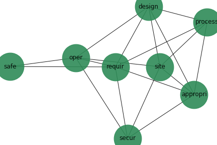

# Keyword and Topic modelling for Portfolio set-up

**[Purpose](#Purpose)** | **[Motivation](#Motivation)** |**[Features](#Features)**|**[Example-results](#Example-results)** |**[Prerequisites](#Prerequisites)** |**[Quick start](#Quick-start)** |**[How-to-use](#How-to-use)**|

# Purpose 

**For any set of portfolio documents, automatically generate keywords and summaries per document, and generate a set of the main topics found. Accordingly, generate a data-model for the portfolio** 

# Motivation

Projects have different business and function aspects. These notebooks can be used to run simple code on a set of pdf and text files that the user has collected for their particular business domain. 

Below is basic code that can be applied directly to  any portfolio documents. Here this code is worked through with an example of understanding the implications of the regulatory environment on project delivery in the nuclear sector.This can be replaced as the user generates her own results. 

For simplicity, this one starts from documents as text files and internet pages. Additional features can be sought in the other notebooks once first results have been generated for your portfolio documents. 

# Features
- Summarises each document
- finds keywords for each document
- creates a similarity-search: for any new paragraph, it finds the most similar documents from the library
- prepares a topic model of the library
- creates a knowledge graph of the project context
- proposes a data-model for the portfolio, based upon these findings 

# Example-results
These results are short extracts from the [Interim-results folder](https://github.com/lawrencerowland/Data-Model-for-Project-Frameworks/tree/master/Project-frameworks-by-using-NLP-with-Python-libraries/Interim-results) which shows the results applied to the nuclear example. 

## Automatic summary of each document

***For the Commissioning of security systems and infrastructure document ***

'The scale of the commissioning activity should be proportionate to the level of complexity and degree of impact that the project will have on the site or facility’s ability to meet its security outcome as defined in Annexes C and D of SyAPs. This TAG is aimed at providing guidance to the inspector when assessing the adequacy of the commissioning arrangements demonstrated through the performance of the equipment (and those personnel who will manage, operate and maintain it) and the adequacy of the procedures to support the operation of that equipment."

## Automatic identification of keywords

***For the Commissioning of security systems and infrastructure document***

|security     |secure      |securely     |
|regulates    |regulations |regulation   |
|commissioning|commissioned|             | 
|reference    |references  |             |
|document     | documents  |documentation|
|nuclear      |            |             |
|onr          |            |             |    
| refer       |refers      |             |       

## Keywords for the whole library
This is the top few, but you can set how many you require. 

## Knowledge graph
This normally goes through a certain amount of review with stakeholders (steps 8 onward), but this is the first one directly from the top keywords. 

# Prerequisites 

The following Python libraries are needed: Gensim, BS4, NetworkX, Matplotlib, Pandas. Also NLTK and SpaCy. Gensim requires NumPy and SciPy. NLTK requires Pandas. Pdfminersix if you are starting from Pdfs

For example, if one chooses to do it in Conda:

1. Install Miniconda

1. Create GENSIM_ENV environment with an appropriate Python version

1. Install Gensim dependencies. Currently these are NumPy then SciPy and then Gensim 

1. conda activate GENSIM_ENV . Then jupyter lab

(one may need to also activate the Env again once in Jupyter lab)

Or if one is using the Python Venv module

1. Create module (eg. ‘ensim_Env’)

1. Activate using source Gensim_Env/bin/activate in terminal

1. start jupyter lab 
(one may need to also activate the Env again once in Jupyter lab)

From Step 8 onwards, it is recommended you install Neo4j.
Although it can be done on cloud versions of Neo4j, or on YEd, or YEd live, or on Gephi. 

# Quick-start

The user can go straight to the [notebook folder](https://github.com/lawrencerowland/Data-Model-for-Project-Frameworks/tree/master/Project-frameworks-by-using-NLP-with-Python-libraries/Jupyter-notebooks) and work down the steps. 

Otherwise it is suggested to move straight down to **[How-to-use](#How-to-use)**| to get started.There is a list of steps, which also shows which are optional. Each step has its own notebook, which explains the step and provides the code,and shows an example. 

Attributes and adjustments are included immediately below for ease of reference, but best consulted after using the notebook.
To see which steps you want to use first, you can look at the [Interim-results folder](https://github.com/lawrencerowland/Data-Model-for-Project-Frameworks/tree/master/Project-frameworks-by-using-NLP-with-Python-libraries/Interim-results) which shows the results applied to the nuclear example. 

# Attributes
- Uses GENSIM library
- Starts from Text file rather than PDF
- also starts from Internet page
- creates corpus at Document level rather than paragraph level
- for Topic model, starts from Bag of Words model, as an interim step only
- It uses TFIDF model only as an interim step to LSI only
- for similarity-search, it uses cosine similarity, based upon TFIDF model

# Attributes you can find in the other notebooks
- Using other libraries than Gensim
- creates corpus at paragraph level or sentence level
- similarity from LSI rather than just TFIDF

# How-to-use 

## Sequence of steps

You can go straight to the required notebook by clicking on the links below. 

However the optional early steps, such as 3 and 4, are very useful in getting an immediate summary and keywords for each document. 

One route through has been shown by the steps marked bold below. These steps focus on the topic modelling. 

| #  | Step                                       | Link                                                                                                     |
| ----- | --------------------------------------------- | ---------------------------------------------------------------------------------------------------------- |
| 1     | Handle pdfs                                   | [notebook](https://github.com/lawrencerowland/Data-Model-for-Project-Frameworks/blob/master/Project-frameworks-by-using-NLP-with-Python-libraries/Jupyter-notebooks/Step-1-handle-pdfs.ipynb)      |
| 2     | Handle internet pages                         | [notebook](https://github.com/lawrencerowland/Data-Model-for-Project-Frameworks/blob/master/Project-frameworks-by-using-NLP-with-Python-libraries/Jupyter-notebooks/Step-2-collect-internet.ipynb) |
| 3     | Discover keywords for each document           |  [notebook](https://github.com/lawrencerowland/Data-Model-for-Project-Frameworks/blob/master/Project-frameworks-by-using-NLP-with-Python-libraries/Jupyter-notebooks/Step-3-Summaries-for-each-document.ipynb)                                                                                                 |
| 4     | Prepare automatic summaries for each document | [notebook](https://github.com/lawrencerowland/Data-Model-for-Project-Frameworks/blob/master/Project-frameworks-by-using-NLP-with-Python-libraries/Jupyter-notebooks/Step-4-Keywords-for-each-document.ipynb)                                                                                               |
| 5     | **Create one library**                        |      [notebook](https://github.com/lawrencerowland/Data-Model-for-Project-Frameworks/blob/master/Project-frameworks-by-using-NLP-with-Python-libraries/Jupyter-notebooks/Step-5-Create-one-library.ipynb)                                                                                                  |
| 6     |Discover keywords across whole library         |                                                                                                        [notebook](https://github.com/lawrencerowland/Data-Model-for-Project-Frameworks/blob/master/Project-frameworks-by-using-NLP-with-Python-libraries/Jupyter-notebooks/Step-6-Discover-keywords-whole-library.ipynb)|
| 7     | Create knowledge graph from keywords          |                                                                                                    [notebook](https://github.com/lawrencerowland/Data-Model-for-Project-Frameworks/blob/master/Project-frameworks-by-using-NLP-with-Python-libraries/Jupyter-notebooks/Step-7-knowledge-graph-from-keywords.ipynb)
|
| 8     | **Outline the business domain**                   |                                                                                                        [notebook](https://github.com/lawrencerowland/Data-Model-for-Project-Frameworks/blob/master/Project-frameworks-by-using-NLP-with-Python-libraries/Jupyter-notebooks/Step-8-Outline-the-business-domain.ipynb)|
| 9     | **Create TFIDF model**                   |                                                                                                        [notebook](https://github.com/lawrencerowland/Data-Model-for-Project-Frameworks/blob/master/Project-frameworks-by-using-NLP-with-Python-libraries/Jupyter-notebooks/Step-9-Create_TFIDF_model.ipynb)|
| 10     | How similar are these documents?                |                                                                                                        [notebook](https://github.com/lawrencerowland/Data-Model-for-Project-Frameworks/blob/master/Project-frameworks-by-using-NLP-with-Python-libraries/Jupyter-notebooks/Step-10-How-similar-are-these-documents.ipynb)|
| 11     | Similarity for a fresh text                |                                                                                                        [notebook](https://github.com/lawrencerowland/Data-Model-for-Project-Frameworks/blob/master/Project-frameworks-by-using-NLP-with-Python-libraries/Jupyter-notebooks/Step-10-Similarity_for_a_fresh_text.ipynb)|
| 12     | **Create topic model**                |                                                                                                        [notebook](https://github.com/lawrencerowland/Data-Model-for-Project-Frameworks/blob/master/Project-frameworks-by-using-NLP-with-Python-libraries/Jupyter-notebooks/Step-10-Create_topic_model.ipynb)|
|
| 13     | **Create Knowledge Graph from topic models**                |                                                                                                        [notebook](https://github.com/lawrencerowland/Data-Model-for-Project-Frameworks/blob/master/Project-frameworks-by-using-NLP-with-Python-libraries/Jupyter-notebooks/Step-13-Create-KG-from_topic-models.ipynb)|
|
| 14     | Create any new_Knowledge Graphs for comparisons                |                                                                                                        [notebook](https://github.com/lawrencerowland/Data-Model-for-Project-Frameworks/blob/master/Project-frameworks-by-using-NLP-with-Python-libraries/Jupyter-notebooks/Step-14-Create_any_new_KGs_for_comparison.ipynb)|
|
| 15     | Extend KG with more keywords                |                                                                                                        [notebook](https://github.com/lawrencerowland/Data-Model-for-Project-Frameworks/blob/master/Project-frameworks-by-using-NLP-with-Python-libraries/Jupyter-notebooks/Step-15-Extend-KG-with-more-keywords.ipynb)|
|
| 16     | **Combine Knowledge Graphs**                |                                                                                                        [notebook](https://github.com/lawrencerowland/Data-Model-for-Project-Frameworks/blob/master/Project-frameworks-by-using-NLP-with-Python-libraries/Jupyter-notebooks/Step-16-Combine_KGs.ipynb)|

# Future directions
1. *better strategic alignment* via simultaneous multiple strategic views at any one time. Each view reflects a different stakeholder perspective of what matters. 
2. *manage business dependencies* by managing project within graph database
3. *project success prediction* via graph neural networks hosted on graph database

