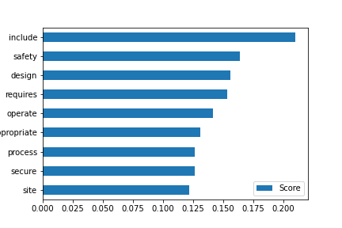
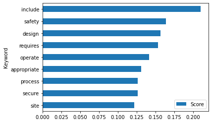
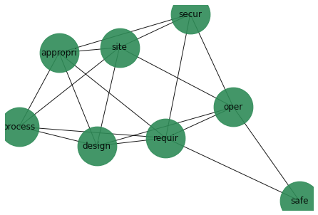

# 1st Notebook example: Keyword and Topic modelling


**[Purpose](#Purpose)** | **[Motivation](#Motivation)** |**[Features](#Features)**|**[Example-results](#Example-results)** |**[Prerequisites](#Prerequisites)** |**[Quick start](#Quick-start)** |**[How-to-use](#How-to-use)**|

# Purpose 

**For any set of portfolio documents, automatically generate keywords and summaries per document, and generate a set of the main topics found. Accordingly, generate a data-model for the portfolio** 


# Motivation

Projects have different business and function aspects. These notebooks can be used to run simple code on a set of pdf and text files that the user has collected for their particular business domain. 

Below is basic code that can be applied directly to  any portfolio documents. Here this code is worked through with an example of understanding the implications of the regulatory environment on project delivery in the nuclear sector.This can be replaced as the user generates her own results. 

For simplicity, this one starts from documents as text files and internet pages. Additional features can be sought in the other notebooks once first results have been generated for your portfolio documents. 

# Features
- Summarises each document
- finds keywords for each document
- creates a similarity-search: for any new paragraph, it finds the most similar documents from the library
- (propose a data-model for the portfolio, based upon these findings) ***(Status: incomplete)***

# Example-results
These results are short extracts from the [Interim-results folder](https://github.com/lawrencerowland/Data-Model-for-Project-Frameworks/tree/master/Project-frameworks-by-using-NLP-with-Python-libraries/Interim-results) which shows the results applied to the nuclear example. 

## Automatic summary of each document

***For the Commissioning of security systems and infrastructure document ***

'The scale of the commissioning activity should be proportionate to the level of complexity and degree of impact that the project will have on the site or facility’s ability to meet its security outcome as defined in Annexes C and D of SyAPs. This TAG is aimed at providing guidance to the inspector when assessing the adequacy of the commissioning arrangements demonstrated through the performance of the equipment (and those personnel who will manage, operate and maintain it) and the adequacy of the procedures to support the operation of that equipment."

## Automatic identification of keywords

***For the Commissioning of security systems and infrastructure document***

| security | commissioning | reference  | document      | regulation  | nuclear | onr |
| securely | commissioned  | references | documentation | regulations |         |     |
| secure   |               | refer      | documents     | regulates   |         |     |
|          |               | refers     |               |             |         |     |

## Keywords for the whole library
This is the top few, but you can set how many you require. 


## Knowledge graph
This normally goes through a certain amount of review with stakeholders (steps 8 onward), but this is the first one directly from the top keywords. 


# Prerequisites 

The following Python libraries are needed: Gensim, BS4, NetworkX, Matplotlib, Pandas. Also NLTK and SpaCy. Gensim requires NumPy and SciPy. NLTK requires Pandas. Pdfminersix if you are starting from Pdfs

For example, if one chooses to do it in Conda:

1. Install Miniconda

1. Create GENSIM_ENV environment with an appropriate Python version

1. Install Gensim dependencies. Currently these are NumPy then SciPy and then Gensim 

1. conda activate GENSIM_ENV . Then jupyter lab

(one may need to also activate the Env again once in Jupyter lab)

From Step 8 onwards, it is recommended you install Neo4j.
Although it can be done on cloud versions of Neo4j, or on YEd, or YEd live, or on Gephi. 

# Quick-start

The user can go straight[notebook folder](https://github.com/lawrencerowland/Data-Model-for-Project-Frameworks/tree/master/Project-frameworks-by-using-NLP-with-Python-libraries/Jupyter-notebooks) and work down the steps. 

Otherwise it is suggested to move straight down to **[How-to-use](#How-to-use)**| to get started.There is a list of steps, which also shows which are optional. Each step has its own notebook, which explains the step and provides the code,and shows an example. 

Attributes and adjustments are included immediately below for ease of reference, but best consulted after using the notebook.
To see which steps you want to use first, you can look at the [Interim-results folder](https://github.com/lawrencerowland/Data-Model-for-Project-Frameworks/tree/master/Project-frameworks-by-using-NLP-with-Python-libraries/Interim-results) which shows the results applied to the nuclear example. 

# Attributes
- Uses GENSIM library
- Starts from Text file rather than PDF
- also starts from Internet page
- creates corpus at Document level rather than paragraph level
- for Topic model, starts from Bag of Words model, as an interim step only
- It uses TFIDF model only as an interim step to LSI only
- for similarity-search, it uses cosine similarity, based upon LSI model

# Attributes you can find in the other notebooks
- Using other libraries than Gensim
- Starting from Text file
- creates corpus at paragraph level
- uses Bag of Words model to generate results directly for similarity search

# Easy adjustments that can be made, but have not been shown
- for Topic model, uses only Bag of Words model 
- for similarity-search, using cosine similarity, based upon TFIDF model
- for topic model, uses methods other than LSI. 

# How-to-use

(Status): Steps 1-8 have working notebooks which generate useful results. 

## Sequence of steps

Core steps are in bold. You can go straight to the required notebook by clicking on the links below. 
There is also a summary of the Core steps in the section below

However the optional early steps, such as 3 and 4, are very useful in getting an immediate summary and keywords for each document. 

| Step  | Handl                                         | Option                                                                                                     |
| ----- | --------------------------------------------- | ---------------------------------------------------------------------------------------------------------- |
| 1     | Handle pdfs                                   | [notebook](https://github.com/lawrencerowland/Data-Model-for-Project-Frameworks/blob/master/Project-frameworks-by-using-NLP-with-Python-libraries/Jupyter-notebooks/Step-1-handle-pdfs.ipynb)      |
| 2     | Handle internet pages                         | [notebook](https://github.com/lawrencerowland/Data-Model-for-Project-Frameworks/blob/master/Project-frameworks-by-using-NLP-with-Python-libraries/Jupyter-notebooks/Step-2-collect-internet.ipynb) |
| 3     | Discover keywords for each document           |  [notebook](https://github.com/lawrencerowland/Data-Model-for-Project-Frameworks/blob/master/Project-frameworks-by-using-NLP-with-Python-libraries/Jupyter-notebooks/Step-3-Summaries-for-each-document.ipynb)                                                                                                 |
| 4     | Prepare automatic summaries for each document | [notebook](https://github.com/lawrencerowland/Data-Model-for-Project-Frameworks/blob/master/Project-frameworks-by-using-NLP-with-Python-libraries/Jupyter-notebooks/Step-4-Keywords-for-each-document.ipynb)                                                                                               |
| 5     | **Create one library**                        |      [notebook](https://github.com/lawrencerowland/Data-Model-for-Project-Frameworks/blob/master/Project-frameworks-by-using-NLP-with-Python-libraries/Jupyter-notebooks/Step-5-Create-one-library.ipynb)                                                                                                  |
| 6     | **Discover keywords across whole library**         |                                                                                                        [notebook](https://github.com/lawrencerowland/Data-Model-for-Project-Frameworks/blob/master/Project-frameworks-by-using-NLP-with-Python-libraries/Jupyter-notebooks/Step-6-Discover-keywords-whole-library.ipynb)|
| 7     | **Create knowledge graph from keywords**          |                                                                                                    |[notebook](https://github.com/lawrencerowland/Data-Model-for-Project-Frameworks/blob/master/Project-frameworks-by-using-NLP-with-Python-libraries/Jupyter-notebooks/Step-7-knowledge-graph-from-keywords.ipynb)
| 8     | **Outline the business domain**                   |                                                                                                        [notebook](https://github.com/lawrencerowland/Data-Model-for-Project-Frameworks/blob/master/Project-frameworks-by-using-NLP-with-Python-libraries/Jupyter-notebooks/Step-8-Outline-the-business-domain.ipynb)|

## Next-enhancements
- Steps 9-10 Topic modelling
- Incorporation of Topic models into the knowledge graph
- Adding back the lower-level keywords into knowledge graph
Combine this knowledge graph with one based on stakeholder requirements
- Show how this flows into either Portfolio services or Data model, depending on type (apply this to Invernizzi, Locatelli, Brookes 2020
- Show how alternative views come off from one central knowledge graph
- show trees (for outlines) coming for a view, from depth based search in networkx


## Summary-of-core-steps

### Step-5: Compile a single library

#### Overview
This pulls the Corpus together as one text string. 

#### How-to-use

#### Installation

Check installation has been made, as per the [READme](https://github.com/lawrencerowland/Data-Model-for-Project-Frameworks/blob/master/Project-frameworks-by-using-NLP-with-Python-libraries/README.md)

#### Prior-steps
Either Step 1 or Step 2 if you are loading new documents. 

Or if documents are already text files, then they can just be copied to the folder.

Steps 3 and 4 are optional.

#### How-to-use

#### Change Directory to find the portfolio text files

This code uses the OS module to select the file with the user's text-files.

#### Create 1 whole Corpus
This pulls the Corpus together as one text string. 

#### Save interim results to a single document
This code saves this new text files to the folder:
- Corpus_as_one_string


```python
directory= "/Users/lawrence/Documents/GitHub/Data-Model-for-Project-Frameworks/Project-frameworks-by-using-NLP-with-Python-libraries/Interim-results/"
```

```python
#e.g.
filename="Corpus_as_one_string"
f= open(directory+filename+".txt","w+") 
f.write(Corpus_as_one_string)
f.close()
```

### Step 6 Create keywords for whole corpus




#### Overview
This can be adjusted to allow for number of words returned, and to specify how to treat keywords with similar stems. Here are the ones for the nuclear example.

#### Prior-steps
Steps 1-4 are optional. 
Step 5 is required. 

#### How-to-use

#### Import Gensim
The code is provided for the specific modules to be imported

#### Open the Interim results folder

#### List showing relative prominence of these words
This is a more complete analysis than just summing the keywords produced in Step 4, due to network effects. 
Here are the results for keywords across all ONR documents. 

Select the number of words required. 
The 'keywords'API uses a TextRank based on PageRank, but complemented with other measures of keyword importance.The API automatically generates word-stems, as can be seen by the results, where clusters of words with the same stems have the same score. e.g. there is requires, required, requirements etc. We drop unwanted synonyms from the results.

```python
Keywords_for_whole_corpus=keywords(Corpus_as_one_string, words=10, scores=True, lemmatize=False, deacc=False)
# Other options are split=False, pos_filter=('NN', 'JJ')
```

```python
df = pd.DataFrame(Keywords_for_whole_corpus, columns =['Keyword', 'Score']) 
```

#### Select unwanted keywords

```python
#Drop those synonyms we don't want. Enter the row numbers in the list by inspection of the results.
df=df.drop([0,2,3,5,7,8,9,10,11,13,14,15,16,17,18,19,20,21,23,24,25,26,27,28,29,30,32,33,35,36,37,38,39,41,42,44,45,46])
```

```python
df = df[::-1] # reverses the order
```

```python
#### Create interim-results file
df.to_csv(directory+'Keywords_for_whole_corpus.csv', index=False)
```

```python
import matplotlib.pyplot as pyplot
figure1=df.plot(kind='barh', x='Keyword', y="Score")
pyplot.savefig(directory+'Keywords-for-whole-library.png') #saves last figure generated
```





# Next-steps
[Step 7] show how to access the relationships between selected keywords, and show it as a knowledge graph. 

#### Postscript: Alternative keyword algorithm
If it is helpful to compare the above results with another approach, then Gensim also has an API for another algorithm

```python
#### Montemurro and Zanette’s entropy based keyword extraction algorithm
alternative=mz_keywords(Corpus_as_one_string,split=False,scores=False,weighted=False,threshold="auto")
```

```python
print(alternative[0:100])
```

#### Acknowledgments:
[Kite.com](https://kite.com/python/docs/gensim.summarization.mz_keywords) has some useful information on the MZ algorithm. This is below:

'This algorithm looks for keywords that contribute to the structure of the text on scales of `blocksize` words of larger. It is suitable for extracting keywords representing the major themes of long texts.'

Info on parameters:
- blocksize: int, optional: Size of blocks to use in analysis.
- weighted: bool, optional. Whether to weight scores by word frequency. False can useful for shorter texts, and allows automatic thresholding.
- threshold: float or 'auto', optional
- Minimum score for returned keywords,  'auto' calculates the threshold as n_blocks / (n_blocks + 1.0) + 1e-8,
    use 'auto' with `weighted=False`.

### Step 7: Build knowledge-graph-from-keywords


#### Overview
This accesses the relationships between selected keywords, and show it as a knowledge graph. 
This will allow subsequent steps to craft an appropriate portfolio services framework within the particular business domain being analysed.
These linkages suggest ways of laying out the knowledge area under question.

#### Prior-steps
Step 5 and 6

#### How-to-use
Work from this description or the equivalent Jupyter [notebook](https://github.com/lawrencerowland/Data-Model-for-Project-Frameworks/blob/master/Project-frameworks-by-using-NLP-with-Python-libraries/Jupyter%20notebooks/Step-7-knowledge-graph-from-keywords.ipynb). Any code omitted for clarity is available in the notebook.

#### Import modules

#### Open the interim results folder

#### Generate a full graph of links between all words in all documents

Gensim does this with an application of the TextRank algorithm, which is an extension of PageRank. The get_graph API contains all (stemmed) words, from which these keywords have been drawnSome of the results have already been seen, as Keywords  extractions from these main results. 

```python
h=get_graph(Corpus_as_one_string)
```

The first time it is worth exploring this graph object to understand it:some examples are given in the notebook. 
The nuclear example generates a graph with 2930 nodes, each a stemmed word. 

#### Locate our keywords in the graph object
We are interested just in the relationships inbetween the keywords we have already identified. 

In Step 6 we identified the specific keywords we were interested in. We have already dropped synonyms.

Now we also ignore 'ONR' and 'include' as unhelpful. 

This leaves us with **safety, design, requires, operate, appropriate, process, secure and site**

Because the words are stemmed in this graph object, the 'neighbors' API is needed to find the stem-word for all of the keywords.

```python
h.neighbors("includ") # run this a few times until you find the 'stem' being used for each keyword you want
```


    ['system',
     'qualiti',
     'secur',
     'cyber',
     'regul',
     'infrastructur',
     'assur',
     'clear',
     'uninterrupt',
     'provis',
     'condit',
     'train',
     'sqep',
     'control',
     'prepar',
     'interfac',
     'supplier',
     'code',
     'nation',
     'identif',
     'plan',
     'action',
     'close',
     'record',
     'commerci',
     'level',
     'commun',
     'addit',
     'cement',
     'fix',
     'issu',
     'align',
     'draw',
     'appropri',
     'compound',
     'natur',
     'matter',
     'except',
     'sourc',
     'guidanc',
     'fuel',
     'relev',
     'ekp',
     'fault',
     'pressur',
     'time',
     'intervent',
     'broad',
     'effect',
     'segreg',
     'calibr',
     'examin',
     'paragraph',
     'form',
     'offici',
     'temperatur',
     'dispos',
     'process',
     'legisl',
     'decommiss',
     'plant',
     'capabl',
     'typic',
     'design',
     'facil',
     'exampl',
     'select',
     'stakehold',
     'ensur',
     'impact',
     'reus',
     'enabl',
     'respons',
     'consider',
     'lifecycl',
     'contamin',
     'wast',
     'featur',
     'activ',
     'procedur',
     'methodolog',
     'manag',
     'potenti',
     'justif',
     'project',
     'arrang',
     'chang',
     'exempt',
     'gener',
     'inspect',
     'caus',
     'oper',
     'assess',
     'modif',
     'suffici',
     'transit',
     'spent',
     'import',
     'avail',
     'applic',
     'iaea',
     'forc',
     'type',
     'test',
     'proof',
     'format',
     'us',
     'instruct',
     'maintain',
     'author',
     'intellig',
     'safeti',
     'accid',
     'evid',
     'site',
     'discharg',
     'analysi',
     'standard',
     'alarp',
     'instal',
     'onr',
     'explicitli',
     'undertak',
     'explicit',
     'aim',
     'note',
     'risk',
     'convent',
     'decis',
     'aspect',
     'measur',
     'thing',
     'practic',
     'industri',
     'outcom',
     'advic',
     'materi',
     'nuclear',
     'pre',
     'case',
     'llw',
     'secondari',
     'routin',
     'inventori',
     'programm',
     'strategi',
     'bat',
     'document',
     'individu',
     'factor',
     'requir',
     'permit',
     'optimis',
     'shall',
     'hierarchi',
     'barrier',
     'option',
     'filtrat',
     'encapsul',
     'characterist',
     'non',
     'specif',
     'decai',
     'uncondit',
     'criteria',
     'review',
     'radionuclid',
     'packag',
     'treatment',
     'build',
     'look',
     'ground',
     'inform',
     'heavi',
     'event',
     'protest',
     'goal',
     'organis',
     'agreement',
     'post',
     'necessari',
     'long',
     'achiev',
     'ordinarili',
     'propos',
     'indic',
     'failur',
     'previous',
     'ideal',
     'timescal',
     'stage',
     'equip',
     'chain',
     'withdraw',
     'verif',
     'lower',
     'contract',
     'psa',
     'radioact',
     'sequenc',
     'misdiagnosi',
     'sever',
     'submiss',
     'make',
     'model',
     'ccf',
     'compil',
     'tag',
     'hazard',
     'provid',
     'i',
     'partial',
     'compon',
     'frequenc',
     'unavail',
     'task',
     'cutset',
     'merit',
     'core',
     'appendix',
     'worker',
     'analys',
     'success',
     'mission',
     'explain',
     'environment',
     'transpar',
     'descript',
     'correctli',
     'base',
     'content',
     'hep',
     'hfe',
     'popul',
     'power',
     'associ',
     'list',
     'detail',
     'high',
     'physic',
     'identifi',
     'fragil',
     'sensit',
     'minim',
     'determinist',
     'apet',
     'on',
     'rc',
     'propag',
     'tabl',
     'fit',
     'undertaken',
     'depend',
     'license',
     'simul',
     'item',
     'state',
     'dutyhold',
     'altern',
     'mainten',
     'context',
     'perform',
     'element',
     'implement',
     'end',
     'proportion',
     'cop',
     'interrupt',
     'confirm',
     'servic',
     'wai',
     'obtain',
     'sampl',
     'notif',
     'incid',
     'busi',
     'work',
     'resourc',
     'personnel',
     'final',
     'divers',
     'have',
     'comprehens',
     'result',
     'refer']


After manually entering in different stems, I find the following match the keywords I want.

'safe', 'design' 'requir','oper','appropri','process','secur','site', 'onr','includ'.


#### Generate a NetworkX graph

The Gensim graph object is not very easy to handle. We transfer it to a NetworkX graph. 

```python
g = nx.Graph()
g=g.to_undirected() #my addition
for edge in h.edges():
    
    g.add_node(edge[0])
    g.add_node(edge[1])
    g.add_weighted_edges_from([(edge[0], edge[1], h.edge_weight(edge))])

    h.edge_weight(edge) #doesn't seem to be needed
```

#### Reduce the graph to just those links between keywords
The above graph can be plotted, but its pretty dense. 
i.e. Manually list the stems you want to keep. 
The line below removes all nodes except for the keyword-stems.

```python
g.remove_nodes_from([n for n in g if n not in set(['safe', 'design', 'requir','oper','appropri','process','secur','site'])])
```

```python
g.nodes()
```


    NodeView(('requir', 'design', 'site', 'secur', 'appropri', 'oper', 'process', 'safe'))


#### Plot graph between keywords

```python
pos = nx.spring_layout(g)
figure1=plt.figure()
nx.draw(g, pos, edge_color='black', width=1, linewidths=1,node_size=3000, node_color='seagreen', alpha=0.9,labels={node: node for node in g.nodes()})
plt.axis('off')
plt.savefig(directory+'Knowledge-graph-from-keywords-1.png') #saves last figure generated
```

```python
plt.show()
```





```python
nx.write_graphml(g, directory+'Keyword-graph.graphml', encoding='utf-8', prettyprint=True, infer_numeric_types=False)
```

#### Next-steps
[Step 8] uses this keyword model to outline the business domain relating to the whole library collected. 

#### Postscript: Alternative
Instead of removing nodes, a subgraph can be generated, but it does not allow one to throw away the full graph. 

```python
Graph_only_top_nodes=all_node_nx_graph.subgraph(['safe', 'onr', 'requir','includ','design','site','secur','process','appropri','oper'])
```

#### Acknowledgements
This article showed how to move from Gensim to Networkx [here](https://dev.to/b_dmarius/python-keywords-extraction-machine-learning-project-series-part-2-2bii)


