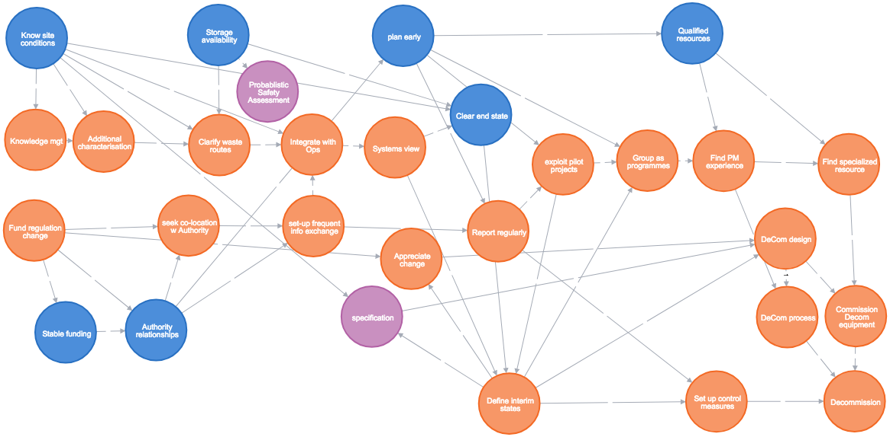
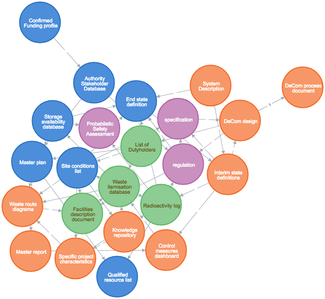
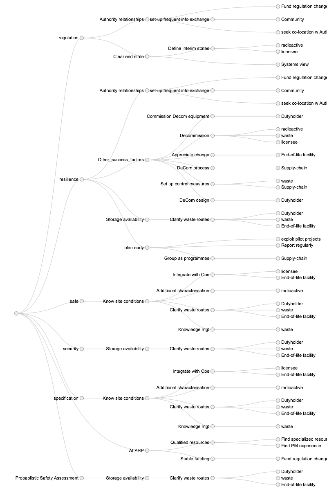
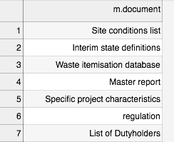
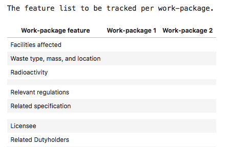

# Setting-up projects with known success-factors

# Key points
1. Projects can be characterised to reflect their specific business domain.
2. This is reflected in project plans, documentation, features and strategy.
3. These artefacts are generated from a success-factors paper & business library.
4. This is generated by a knowledge graph that uses keyword & topic models.
5. Software is free and method is recorded, so it can be applied by project teams.
# Visual abstract

<image src="Jupyter-notebooks/images/visual_abstract.png"/>

# Outputs
1. Project plan
2. Project documentation list
3. Feature list for project work-packages
4. Table of Contents for the Project Strategy
+++
# Inputs
1. A paper identifying success factors for this type of project
2. A library of relevant guidance / regulations
# Methods
1. Automated Keyword extraction
2. Automated Topic Modelling
3. Knowledge graph creation. 
# Abstract
Projects are often controlled with plans, documentation lists, feature lists and strategies. We demonstrate how to create these artefacts from document libraries and a list of project success-characteristics. These sources are specific to the sector and organisation in question. In this way, we generate slim project-management artefacts that are both consistent and applicable to the project context. This is done by using natural language processing to generate a knowledge graph which generates the four artefacts. This worked-example looks at the project characteristics for a UK nuclear decommissioning project. 
# Keywords
project management, project controls, project set-up, project strategy, project innovation, project characterisation, project data models, machine learning, topic models, natural language processing, graph database, knowledge graphs.
+++
# OUTPUT 1: Project plan and work-breakdown
## Project plan
| Project Activity                | Successor Project-Activities                                                                                                       |
| ------------------------------- | ---------------------------------------------------------------------------------------------------------------------------------- |
| "Know site conditions"          | ["Integrate with Ops", "Additional characterisation", "specification", "Clarify waste routes", "Clear end state", "Knowledge mgt"] |
| "Report regularly"              | ["exploit pilot projects", "Set up control measures"]                                                                              |
| "plan early"                    | ["exploit pilot projects", "Report regularly", "Group as programmes", "Qualified resources"]                                       |
| "exploit pilot projects"        | ["Define interim states", "Group as programmes"]                                                                                   |
| ....                            | ... *full list in appendix*                                                                                       |
##  Visual plan

> Blue(Success factors)
> Orange(Project services)
> Purple (Requirement-related )

+++
##  Work break-down
Here the project-tasks have been grouped by  success-factor.

| Success Factor            | Project Services supporting that Success Factor                                                                                    |
| ------------------------- | ---------------------------------------------------------------------------------------------------------------------------------- |
| "Know site conditions"    | ["specification", "Integrate with Ops", "Clarify waste routes", "Additional characterisation", "Knowledge mgt", "Clear end state"] |
| "Authority relationships" | ["plan early", "set-up frequent info exchange", "seek co-location w Authority", "Stable funding", "Fund regulation change"]        |
| ...    | ...*full list in appendix*|                                                      
 
# OUTPUT 2: Project Documentation list
## List of Documents AND Relationships between documents

 &nbsp; &nbsp; &nbsp;

More central documents have more connections to other documents.
e.g. Waste itemisation database, Facilities Description and regulation.
# OUTPUT 3: Feature list for project work-packages
These are the domain-specific features that should be tracked across the project. i.e. they are the attributes or properties captured for each work-package or sub-project. In this case, many of the features relate to requirements and site/stakeholder  aspects that relate to project tasks. 

| Work-package feature           | Work-package 1 | Work-package 2 |
| ------------------------------ | -------------- | -------------- |
| Facilities affected            |                |                |
| Waste type, mass, and location |                |                |
| Radioactivity                  |                |                |
|                                |                |                |
| Relevant regulations           |                |                |
| Related specification          |                |                |
|                                |                |                |
| Licensee                       |                |                |
| Related Dutyholders            |                |                |
| Supply chain list to date      |                |                |
| Local Community Groups         |                |                |
|                                |                |                |
| Agreed ALARP level             |                |                |
| Safety performance             |                |                |
| Resilience score               |                |                |
| Security performance           |                |                |

These features should be considered for inclusion in any lists and reports per Work-package. This work-package list may be an Excel sheet, or in Power BI or in an EPM system, or SQL database.These features are a key element of the project data-model.
+++
# OUTPUT 4: Project Strategy Table of Contents
The project strategy assists:
- stakeholder groups to understand the business justification
- the team to understand the method of execution. 

The structure should reflect the characteristics of project success in the business domain as well as the language and interests of the strategy consumers. 
+++
### Table of Contents as file

| Level 1 REQUIREMENT                    | Level 2 SUCCESS FACTOR          | Level 3 PROJECT SERVICE               | Level 4 SITE FEATURE         |
| ------------------------------ | ----------------------- | ----------------------------- | -------------------- |
| regulation                     | Authority relationships | Fund regulation change        | null                 |
| regulation                     | Authority relationships | set-up frequent info exchange | Community            |
| regulation                     | Authority relationships | seek co-location w Authority  | null                 |
| regulation                     | Clear end state         | Define interim states         | radioactive          |
| regulation                     | Clear end state         | Define interim states         | licensee             |
| regulation                     | Clear end state         | Systems view                  | null                 |
| ..                     | ***remainder in Appendix***         | ...                | ...               |

This worked-example settled on one of several possible structures, allowing Requirements the highest level in the hierarchy. Two merits of the approach:
- selection of a particular structure is explicit
- stakeholders can be involved in selection.
+++
# Inputs
1. A paper identifying success factors for this type of project
2. A library of relevant guidance / regulations
# INPUT 1: Paper
Invernizzi, Locatelli, Brookes (2020)[^Diletta Colette Invernizzi, Giorgio Locatelli & Naomi J. Brookes (2020): Characterising nuclear decommissioning projects: an investigation of the project characteristics that affect the project performance, Construction Management and Economics, DOI: 10.1080/01446193.2020.1775859
To link to this article: https://doi.org/10.1080/01446193.2020.1775859)] propose the following factors in successful nuclear decommissioning projects:

| Success factor            | Description                                         |
| ------------------------- | --------------------------------------------------- |
| "Know site conditions"    | "detailed knowledge of the site conditions"         |
| "Authority relationships" | "good relationship with the regulatory authorities" |
| "Storage availability"    | "the availability of storage facilities"            |
| "Clear end state"         | "Clear site end state permits scope definition"     |
| "Stable funding"          | "Stable funding"                                    |
| "plan early"              | "It’s a plan that goes from cradle to grave!"       |
| "Qualified resources"     | "The availability of suitably qualified resources"  |

The paper also proposes project tasks to support these factors:

| Project_Service                 | Description                                                                                                                                                                                                                                                                                                                                                                                                                                                                                                                               |
| ------------------------------- | ----------------------------------------------------------------------------------------------------------------------------------------------------------------------------------------------------------------------------------------------------------------------------------------------------------------------------------------------------------------------------------------------------------------------------------------------------------------------------------------------------------------------------------------- |
| "Appreciate change"   | (interpreted as change to the site, as well as to project context)                                                                                                                                                                                                                                                                                                                                                                                                                                                                                                                      |
| "Systems view"   | Take a systems view                                                                                                                                                                                                                                                                                                                                                                                                                                                                                                                       |
| "Additional characterisation"   | "Characterise NDPs"                                                                                                                                                                                                                                                                                                                                                                                                                                                                                                                       |
| "Fund regulation change"        | "If additional fund- ing to deal with these changes is not readily available, the overall NDP performance might be affected"                                                                                                                                                                                                                                                                                                                                                                                                              |
| "Find specialized resource"     | specific resources needed for a specialized piece of work, such as resources specialized in                                              high-voltage welding and trained to work on nuclear sites."                                                                                                                                                                                                                                                     |
| "Knowledge mgt"                 | "best practices in knowledge and information management"                                                                                                                                                                                                                                                                                                                                                                                                                                                                                  |
| "Clarify waste routes"          | "clarity regarding the waste routes and about the availability of storage and dis- posal facilities"                                                                                                                                                                                                                                                                                                                                                                                                                                      |
| ...         | ***full list in appendix***                                                                                                                                                                                                                                                                                                                                                                                                                                      |

# INPUT 2: A library of relevant guidance / regulations
The UK Office of Nuclear Regulation  publishes a set of [technical guidance](http://www.onr.org.uk/operational/tech_asst_guides/index.htm) This is a set of pdf documents. This is one element of the regulatory context for nuclear decommissioning projects. A subset of 17 documents were selected for their relevance to project and technical management. 

| Document                                                                     |
| ---------------------------------------------------------------------------- |
| Commissioning-of-security-systems-and-infrastructure-cns-tast-gd-4.4.pdf.txt |
| Construction Assurance ns-tast-gd-076.pdf.txt                                |
| Control of processes involving nuclear matter ns-tast-gd-023.pdf.txt         |
| Decommissioning ns-tast-gd-026.pdf.txt                                       |
| Design Safety Assurance ns-tast-gd-057.pdf.txt                               |
| *full list in appendix*                                |

+++
# Business challenge
- Project structure is often copied from project to project
	- sometimes not fit for purpose
	- sometimes more heavy-weight than needed
- Project plans, strategies and controls are often created separately
# Business motivation
- ensure project characteristics make their way into project controls
- track only the project features that are important
- standardise early consultation across multiple stakeholders and standards
- consistently apply research-findings to improve project performance
# Use Cases
 1. Set-up project in new business area
 2. Set-up project where there are diverse stakeholders and business languages
 3. Refresh organisation's project-model if track-record is poor
 4. up-skill project teams in flexible data-models and machine-learning.
+++
# Methods
## Automated Keyword extraction
Keywords are extracted from the regulations library by scoring each word by how linked that word is to other well-linked words. This provides not just a list of keywords, but also the strength of relationships between keywords. This is done by using the TextRank algorithm, which is like the Google PageRank algorithm for web-pages.
## Automated Topic Modelling
The strongest topics across the regulation library are identified by a topic model method called Latent Direchlet Allocation, or LDA. Murdock (2019)[^[@misc{murdock2019topic,
    title={Topic Modeling the Reading and Writing Behavior of Information Foragers},
    author={Jaimie Murdock},
    year={2019},
    eprint={1907.00488},
    archivePrefix={arXiv},
    link [here](https://arxiv.org/abs/1907.00488v1)] says that 

> 'LDA is a generative model that represents each document as a bag of words generated by a mixture of topics.'

> 'It posits that each document has a distribution of contexts, or topics, that it is composed of.'

## Knowledge graph creation
The above methods generate lists of key concepts from the regulation library, as well as lists of relationships between concepts. The concepts become 'nodes' of a knowledge graph, and the relationships become 'edges' between these nodes. 

> e.g. 'radioactivity' is related to 'waste'. This is an edge connecting 2 nodes.

The success-factors paper contributes a number of success factors, as well as a number of recommended project services to be carried out by the project management team. These are added as nodes. Edges are added where there are:
-  relationships between success factors
-  between project services
-  between a success factor and a project task.

Groups of similar nodes have the same 'labels'.e.g.'success_factor','project_service'.

This combined knowledge graph is one interpretation of project success in Nuclear DeCommissioning.
Next, the project team:
1.  views the graph for useful patterns
2.  reinforces patterns by changing nodes and edges and labels.

The outputs are generated by querying the knowledge graph for specific labels. For example, the Strategy TOC relates to a query which asks for nodes with labels in this order: 

> (requirements)-->(success_factor)-->(project_service)-->(site or stakeholder) 

# Technology applied
All technology is free to use, without subscription. The code is written up in Jupyter notebooks, which allows guidance to sit alongside the code, so limited coding experience is needed. 
1. Gensim is OpenSource
2. NetworkX is OpenSource
3. Neo4j Desktop is free. 
4. Jupyter Notebooks and Python are OpenSource.
5. Yfiles Neo4j Explorer is free

<image src="Jupyter-notebooks/images/gensim.png" width="70" height="50"/> <image src="Jupyter-notebooks/images/NetworkX.svg" width="70" height="50"/> <image src="Jupyter-notebooks/images/neo4j.png" width="70" height="50"/> <image src="Jupyter-notebooks/images/jupyter_icon.png" width="70" height="50"/><image src="Jupyter-notebooks/images/python-logo.png" width="70" height="50"/><image src="Jupyter-notebooks/images/Yfiles.svg" width="70" height="50"/>
+++
# Infographic

&nbsp; &nbsp;&nbsp; &nbsp;&nbsp; &nbsp;&nbsp; &nbsp;&nbsp; &nbsp;&nbsp; &nbsp;&nbsp; &nbsp;&nbsp; &nbsp;&nbsp; &nbsp;&nbsp; <image src="Jupyter-notebooks/images/2020-locatelli-cover.png" width="100" height="50"/> &nbsp;&nbsp; &nbsp;&nbsp; &nbsp;&nbsp; &nbsp;&nbsp; &nbsp;&nbsp;&nbsp; <image src="Jupyter-notebooks/images/ONR_documents_as_library.png" width="100" height="50"/>
<image src="Jupyter-notebooks/images/method.png"/>
 
 &nbsp; &nbsp;    &nbsp; &nbsp;  &nbsp; &nbsp; 

    
# Application to a project
1. clone repository. Apply Jupyter notebooks to your documents
2. use 'human-in-the-loop' filtering of keywords and topics
3. work with project experts during the knowledge-graph stage.

*optional* 

4. use many more documents and keywords where required
5. add stakeholder criteria just as the success paper was added
6. add the team's preferred project framework in the same way.

+++
# Our contribution

> context >> patterns >> form

We apply business *context* to a project. This provides an agreed *form* or structure. We do this by seeking *patterns* and reinforcing those which stakeholders recognise.

Another way of saying the same thing:

> bundle >> unbundle >> deploy

1. *bundle up* the entire business context of the project
2. *unbundle* just enough to structure the project
3. *deploy* the project against this project structure. 
# Limitations
This has been a simple working-example.The results should not be used without scrutiny and amendment by nuclear project managers.
- I have limited experience of the nuclear sector  
- a limited number of keywords were used
- a limited number of documents were used
- I did not review the regulations. 
- there are other regulations which apply. 
# Future directions
1. *better strategic alignment* via simultaneous multiple strategic views at any one time. Each view reflects a different stakeholder perspective of what matters. 
2. *manage business dependencies* by managing project within graph database
3. *project success prediction* via graph neural networks hosted on graph database
# Appendices
Full inputs and outputs are [here](https://github.com/lawrencerowland/Data-Model-for-Project-Frameworks/tree/master/Project-frameworks-by-using-NLP-with-Python-libraries/Jupyter-notebooks/Full-Outputs-and-Inputs.md)

Intermediate results and knowledge graphs are [here](https://github.com/lawrencerowland/Data-Model-for-Project-Frameworks/tree/master/Project-frameworks-by-using-NLP-with-Python-libraries/Jupyter-notebooks/Intermediate-results-and-knowledge-graphs.md)

Code to build Knowledge graph in Neo4j [here](https://github.com/lawrencerowland/Data-Model-for-Project-Frameworks/tree/master/Project-frameworks-by-using-NLP-with-Python-libraries/Jupyter-notebooks/Known_success_factors_output_graph.cypher)

Visualisation of Knowledge graph for viewing on YEd live [here](https://github.com/lawrencerowland/Data-Model-for-Project-Frameworks/tree/master/Project-frameworks-by-using-NLP-with-Python-libraries/Jupyter-notebooks/Known_success_factors_output_graph.graphml)

repository with method and guidance. This should be sufficient for applying this to other projects and sectors. [here](https://github.com/lawrencerowland/Data-Model-for-Project-Frameworks/tree/master/Project-frameworks-by-using-NLP-with-Python-libraries) *July 2020 note: its all there, but working on making it easier to read*

# Acknowledgements
Diletta Colette Invernizzi, Giorgio Locatelli & Naomi J. Brookes (2020): Characterising nuclear decommissioning projects: an investigation of the project characteristics that affect the project performance, Construction Management and Economics, DOI: 10.1080/01446193.2020.1775859 [here](https://doi.org/10.1080/01446193.2020.1775859)

The UK Office of Nuclear Regulation [technical guidance](http://www.onr.org.uk/operational/tech_asst_guides/index.htm)

This project relies extensively on the Gensim[^@inproceedings{rehurek_lrec,
      title = {{Software Framework for Topic Modelling with Large Corpora}},
      author = {Radim {\v R}eh{\r u}{\v r}ek and Petr Sojka},
      booktitle = {{Proceedings of the LREC 2010 Workshop on New
           Challenges for NLP Frameworks}},
      pages = {45--50},
      year = 2010,
      month = May,
      day = 22,
      publisher = {ELRA},
      address = {Valletta, Malta},
      note={\url{http://is.muni.cz/publication/884893/en}},
      language={English}
}] library, and the [examples](https://radimrehurek.com/gensim/auto_examples/index.html) provided by its creator Radim Hurek. I have done nothing more than apply a little of this to Portfolio management. The examples cited above would be the best way to get a full introduction to the capabilities of Gensim.

[NetworkX] used to create knowledge graph from keywords

[Neo4j](www.neo4j.com) Desktop is a graph database used here to create the knowledge graph. 

[Jupyter Notebooks](www.jupyter.org) is an accessible way to provide both guidance and images alongside code in a notebook format.

[Python](www.python.org)

Yfiles Neo4j Explorer is free

Infographic made with [Raw Graphs](rawgraphs.io)

