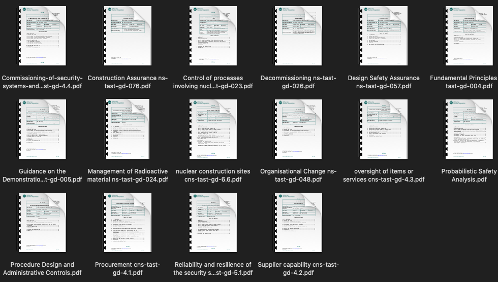

# Setting-up projects with known success-factors

# Key points
1. Projects can be characterised to reflect their specific business domain.
2. This is reflected in project plans, documentation, features and strategy.
3. These artefacts are generated from a success-factors paper & business library.
4. This is generated by a knowledge graph that uses keyword & topic models.
5. Software and method is free, and can be applied by project teams.
# Visual abstract
<image src="Jupyter-notebooks/images/visual_abstract.png"/>
# Keywords
project management, project controls, project set-up, project strategy, project innovation, project characterisation, project data models, topic models, natural language processing, graph database, knowledge graphs.
# Abstract
# Outputs
1. Project plan
2. Project documentation list
3. Feature list for project work-packages
4. Table of Contents for the Project Strategy
# Inputs
1. A library of relevant guidance / regulations
2. A paper identifying success factors for this type of project
# Methods
1. Automated Keyword extraction
2. Automated Topic Modelling
3. Knowledge graph creation. 
# Business challenge
# Motivation
# Use Cases
# Technology applied
All technology is free to use, without subscription. 
1. Gensim is OpenSource
2. NetworkX is OpenSource
3. Neo4j Graph Database: Neo4j Desktop is free. 
4. Jupyter Notebooks and Python are OpenSource.
# Infographic
&nbsp; &nbsp;&nbsp; &nbsp;&nbsp; &nbsp;&nbsp; &nbsp;&nbsp; &nbsp;&nbsp; &nbsp;&nbsp; &nbsp;&nbsp; &nbsp;&nbsp; &nbsp;&nbsp; <image src="Jupyter-notebooks/images/2020-locatelli-cover.png" width="100" height="50"/> &nbsp;&nbsp; &nbsp;&nbsp; &nbsp;&nbsp; &nbsp;&nbsp; &nbsp;&nbsp;&nbsp; 
<image src="Jupyter-notebooks/images/ONR_documents_as_library.png" width="100" height="50"/>
<image src="Jupyter-notebooks/images/method.png"/>
<br>
 &nbsp; &nbsp;    &nbsp; &nbsp;  &nbsp; &nbsp; </div>

 <br />  
# OUTPUT 1: Project plan and work-breakdown
## Project plan
| Project Activity                | Successor Project-Activities                                                                                                       |
| ------------------------------- | ---------------------------------------------------------------------------------------------------------------------------------- |
| "Know site conditions"          | ["Integrate with Ops", "Additional characterisation", "specification", "Clarify waste routes", "Clear end state", "Knowledge mgt"] |
| "Report regularly"              | ["exploit pilot projects", "Set up control measures"]                                                                              |
| "plan early"                    | ["exploit pilot projects", "Report regularly", "Group as programmes", "Qualified resources"]                                       |
| "exploit pilot projects"        | ["Define interim states", "Group as programmes"]                                                                                   |
| ....                            | ... ***full list in appendix***                                                                                       |
##  Visual plan


 <br />
##  Work break-down
The tasks required to support each success-factor. 

| Success Factor            | Project Services supporting that Success Factor                                                                                    |
| ------------------------- | ---------------------------------------------------------------------------------------------------------------------------------- |
| "Know site conditions"    | ["specification", "Integrate with Ops", "Clarify waste routes", "Additional characterisation", "Knowledge mgt", "Clear end state"] |
| "Authority relationships" | ["plan early", "set-up frequent info exchange", "seek co-location w Authority", "Stable funding", "Fund regulation change"]        |
| ...    | ...***full list in appendix***|                                                      
 
# OUTPUT 2: Project Documentation list

**List of Documents AND Relationships between documents**

 &nbsp; &nbsp; &nbsp;

Documents closer to the centre have more connections to other documents.
e.g.
- Waste itemisation database
- Facilities Description
- regulation

 <br />
 <br />

# OUTPUT 3: Feature list for project work-packages

| Work-package feature           | Work-package 1 | Work-package 2 |
| ------------------------------ | -------------- | -------------- |
| Facilities affected            |                |                |
| Waste type, mass, and location |                |                |
| Radioactivity                  |                |                |
|                                |                |                |
| Relevant regulations           |                |                |
| Related specification          |                |                |
|                                |                |                |
| Licensee                       |                |                |
| Related Dutyholders            |                |                |
| Supply chain list to date      |                |                |
| Local Community Groups         |                |                |
|                                |                |                |
| Agreed ALARP level             |                |                |
| Safety performance             |                |                |
| Resilience score               |                |                |
| Security performance           |                |                |


***What** These are the domain-specific features that should be tracked across the project. i.e. they are the attributes or properties captured for each work-package or sub-project. These features are also known as the project data model. 

***Where*** They will be captured in project records. These records may be in:
- a spreadsheet
- a project folder
- a project database
- an Enterprise Project Management tool
- a cloud EPM tool
Some of these feature will appear in project reports and dashboards.

***Why*** These features are key element of the data model for the project, to represent the special characteristics of projects in this business domain. 

If unnecessary features are captured, they will not be used to guide the project, and will be a waste of money and a distraction. 

***With what else?*** These features are often added to features from standard project data models .i.e. scope, schedule, cost etc. 


 <br />
 <br />

# OUTPUT 4: Project Strategy Table of Contents

| Level 1 REQUIREMENT                    | Level 2 SUCCESS FACTOR          | Level 3 PROJECT SERVICE               | Level 4 SITE FEATURE         |
| ------------------------------ | ----------------------- | ----------------------------- | -------------------- |
| regulation                     | Authority relationships | Fund regulation change        | null                 |
| regulation                     | Authority relationships | set-up frequent info exchange | Community            |
| regulation                     | Authority relationships | seek co-location w Authority  | null                 |
| regulation                     | Clear end state         | Define interim states         | radioactive          |
| regulation                     | Clear end state         | Define interim states         | licensee             |
| regulation                     | Clear end state         | Systems view                  | null                 |

<image src="Jupyter-notebooks/images/Strategy_TOC.png"  height=auto/> 


```python
made with rawgraphs.io
```


 <br />
 <br />
 <br />
 <br />
 <br />
 
# ONR Technical library --AUTO--> Keywords + Keyword relationships

  


# Select useful keyword relationships  


# Add back in lower-scoring keywords


<br />
 <br />
 <br />
 <br />
 <br />
 <br />
 <br />
 <br />
 <br />
 <br />
 
# Topic model

# Paper
Success criteria were taken from the paper. 
- extraction focussed on success factors for DeCom that were contributed by the paper

| Success factor            | Description                                         |
| ------------------------- | --------------------------------------------------- |
| "Know site conditions"    | "detailed knowledge of the site conditions"         |
| "Authority relationships" | "good relationship with the regulatory authorities" |
| "Storage availability"    | "the availability of storage facilities"            |
| "Clear end state"         | "Clear site end state permits scope definition"     |
| "Stable funding"          | "Stable funding"                                    |
| "plan early"              | "It’s a plan that goes from cradle to grave!"       |
| "Qualified resources"     | "The availability of suitably qualified resources"  |

Where the paper proposed project tasks in line with the success factor these were recorded. 

| Project_Service                 | Description                                                                                                                                                                                                                                                                                                                                                                                                                                                                                                                               |
| ------------------------------- | ----------------------------------------------------------------------------------------------------------------------------------------------------------------------------------------------------------------------------------------------------------------------------------------------------------------------------------------------------------------------------------------------------------------------------------------------------------------------------------------------------------------------------------------- |
| "Appreciate change"   | (interpreted as change to the site, as well as to project context)                                                                                                                                                                                                                                                                                                                                                                                                                                                                                                                      |
| "Systems view"   | Take a systems view                                                                                                                                                                                                                                                                                                                                                                                                                                                                                                                       |
| "Additional characterisation"   | "Characterise NDPs"                                                                                                                                                                                                                                                                                                                                                                                                                                                                                                                       |
| "Fund regulation change"        | "If additional fund- ing to deal with these changes is not readily available, the overall NDP performance might be affected"                                                                                                                                                                                                                                                                                                                                                                                                              |
| "Find specialized resource"     | "Many many of our projects that you look at, you’ll notice that there is a key resource missing!”. Interviewees referred to specific resources needed for a specialized piece of work, such as resources special- ized in high-voltage welding and trained to work on nuclear sites."                                                                                                                                                                                                                                                     |
| "Knowledge mgt"                 | "best practices in knowledge and information management"                                                                                                                                                                                                                                                                                                                                                                                                                                                                                  |
| "Clarify waste routes"          | "clarity regarding the waste routes and about the availability of storage and dis- posal facilities"                                                                                                                                                                                                                                                                                                                                                                                                                                      |
| "set-up frequent info exchange" | "continuous exchange with the regulatory body. And then, concerning the relationship with the regulator, I would not only say the exchange of information, monthly or weekly"                                                                                                                                                                                                                                                                                                                                                             |
| "Define interim states"         | "imited clarity of the end state hinders the progress of the NDP, and as one inter- viewee explained: “it is really important that this is clear! [...] getting a better definition for the different phases. So, what is ‘Care & Maintenance’ going to look like, what is final state going to look like. And I think you want to put more thoughts in site clearance...but those seem so far away”."                                                                                                                                    |
| "Integrate with Ops"            | "integration between decommissioning projects and radioactive waste management operations is still needed. This is particularly true when a change in regulation occurs"                                                                                                                                                                                                                                                                                                                                                                  |
| "Find PM experience"            | "the lack of project management experience, expressing frustration, e.g. by stating that one of the most critical NDP characteristics is “the capability of actually executing the plan and sticking to it.."                                                                                                                                                                                                                                                                                                                             |
| "seek co-location w Authority"  | "the presence of the regulatory body on the site, "                                                                                                                                                                                                                                                                                                                                                                                                                                                                                       |
| "exploit pilot projects"        | "“programme-based” approach during project planning, i.e. the manage- ment of NDPs in different locations, promoting the sharing of lessons learned across NDPs, was also men- tioned. One interviewee, for instance, explained: “There was a ‘programmized’ approach that every kind of site adopted and actually is greatly received .. adopting generic design for similar projects across the programme. ."                                                                                                                           |
| "Group as programmes"           | "“programme-based” approach during project planning, i.e. the manage- ment of NDPs in different locations, promoting the sharing of lessons learned across NDPs, was also men- tioned. One interviewee, for instance, explained: “There was a ‘programmized’ approach that every kind of site adopted and actually is greatly received [ ... ]. A project that I worked for, the waste programme, we are already anticipating some significant savings as a result of adopting generic design for similar projects across the programme." |
                                                                                                                                                                                                                                                                                                                                                                                                                                                                                                                                                                                                                       |


Whilst reviewing the results as a graph, several other likely project tasks were added:
 

| Project_Services             |
| ---------------------------- |
| "Commission Decom equipment" |
| "Report regularly"           |
| "Decommission"               |
| "DeCom process"              |
| "Set up control measures"    |
| "DeCom design"               |

# List of Project Services

- These services are recommended by the paper. 


| Success Factor            | Project Services supporting that Success Factor                                                                                    |
| ------------------------- | ---------------------------------------------------------------------------------------------------------------------------------- |
| "Know site conditions"    | ["specification", "Integrate with Ops", "Clarify waste routes", "Additional characterisation", "Knowledge mgt", "Clear end state"] |
| "Authority relationships" | ["plan early", "set-up frequent info exchange", "seek co-location w Authority", "Stable funding", "Fund regulation change"]        |
| "Storage availability"    | ["Probablistic Safety Assessment", "Clarify waste routes", "Clear end state"]                                                      |
| "Clear end state"         | ["Systems view", "Define interim states", "Know site conditions", "Storage availability"]                                          |
| "Stable funding"          | ["Fund regulation change", "Authority relationships"]                                                                              |
| "plan early"              | ["Qualified resources", "Authority relationships", "Report regularly", "Group as programmes", "exploit pilot projects"]            |
| "Qualified resources"     | ["plan early", "Find PM experience", "Find specialized resource"]                                                                  |
| (none identified)         | ["Commission Decom equipment", "Decommission", "Appreciate change", "DeCom process", "Set up control measures", "DeCom design"]    |

| Project Activity                | Successor Project-Activities                                                                                                       |
| ------------------------------- | ---------------------------------------------------------------------------------------------------------------------------------- |
| "set-up frequent info exchange" | ["Integrate with Ops", "Report regularly"]                                                                                         |
| "Clarify waste routes"          | ["Integrate with Ops"]                                                                                                             |
| "Know site conditions"          | ["Integrate with Ops", "Additional characterisation", "specification", "Clarify waste routes", "Clear end state", "Knowledge mgt"] |
| "Report regularly"              | ["exploit pilot projects", "Set up control measures"]                                                                              |
| "plan early"                    | ["exploit pilot projects", "Report regularly", "Group as programmes", "Qualified resources"]                                       |
| "exploit pilot projects"        | ["Define interim states", "Group as programmes"]                                                                                   |
| "Systems view"                  | ["Define interim states", "Clear end state"]                                                                                       |
| "Clear end state"               | ["Define interim states"]                                                                                                          |
| "Find specialized resource"     | ["Commission Decom equipment"]                                                                                                     |
| "DeCom design"                  | ["Commission Decom equipment", "DeCom process"]                                                                                    |
| "Knowledge mgt"                 | ["Additional characterisation"]                                                                                                    |
| "Commission Decom equipment"    | ["Decommission"]                                                                                                                   |
| "Set up control measures"       | ["Decommission"]                                                                                                                   |
| "DeCom process"                 | ["Decommission"]                                                                                                                   |
| "Storage availability"          | ["Probablistic Safety Assessment", "Clarify waste routes", "Clear end state"]                                                      |
| "Fund regulation change"        | ["Appreciate change", "Authority relationships", "Stable funding", "seek co-location w Authority"]                                 |
| "Define interim states"         | ["Appreciate change", "Set up control measures", "specification", "Group as programmes", "DeCom design"]                           |
| "Find PM experience"            | ["DeCom process", "Find specialized resource"]                                                                                     |
| "Integrate with Ops"            | ["Systems view"]                                                                                                                   |
| "Additional characterisation"   | ["Clarify waste routes"]                                                                                                           |
| "Stable funding"                | ["Authority relationships"]                                                                                                        |
| "Authority relationships"       | ["plan early", "set-up frequent info exchange", "seek co-location w Authority"]                                                    |
| "seek co-location w Authority"  | ["set-up frequent info exchange"]                                                                                                  |
| "Qualified resources"           | ["Find specialized resource", "Find PM experience"]                                                                                |
| "Group as programmes"           | ["Find PM experience"]                                                                                                             |
| "Appreciate change"             | ["DeCom design"]                                                                                                                   |
| "specification"                 | ["DeCom design"]                                                                                                                   |

# Project features: the Data model

What attributes should be recorded and tracked for each work-package?

- This will normally come from the project framework that has been chosen and the Enterprise Project Management system which is being used. 

- This exercise has highlighted a number of features relevant to successful DeCom projects within an ONR environment.

1. These are taken from the graph database by running a query asking for every requirement or site-element that is directly related to any of the Project services.

2. This produces Column 1, from which we define the relevant work-package characteristic we should know throughout the project (see Column 2)

3. We recommend that these features be considered for inclusion in any lists and reports per Work-package. This work-package list may be an Excel sheet, or in Power BI or in an EPM system, or SQL database

| Requirements and site directly related to Project Services | Features to be added to Work-package descriptions |
| ---------------------------------------------------------- | ------------------------------------------------- |
| "waste"                                                    | Waste type, mass, and location                    |
| "Dutyholder"                                               | Related Dutyholders                               |
| "radioactive"                                              | Radioactivity                                     |
| "licensee"                                                 | Licensee                                          |
| "End-of-life facility"                                     | Facilities affected                               |
| "Community"                                                | Local Community Groups                            |
| "Supply-chain"                                             | Supply chain list to date                         |
| "regulation"                                               | Relevant regulations                              |
| "resilience"                                               | Resilience score                                  |
| "ALARP"                                                    | Agreed ALARP level                                |
| "safe"                                                     | Safety performance                                |
| "specification"                                            | Related specification                             |
| "security"                                                 | Security performance                              |
#  Output 3: Project documentation list
m.document
Site conditions list
Interim state definitions
Waste itemisation database
Master report
Specific project characteristics
regulation
List of Dutyholders
Probablistic Safety Assessment
Radioactivity log
Facilities description document
DeCom process document
Control measures dashboard
System Description
specification
Waste route diagrams
Authority Stakeholder Database
Storage availability database
End state definition
Confirmed Funding profile
Knowledge repository
Master plan
Qualified resource list
DeCom design

# Output4: Strategy Table of Contents

| Level 1 REQUIREMENT                    | Level 2 SUCCESS FACTOR          | Level 3 PROJECT SERVICE               | Level 4 SITE FEATURE         |
| ------------------------------ | ----------------------- | ----------------------------- | -------------------- |
| regulation                     | Authority relationships | Fund regulation change        | null                 |
| regulation                     | Authority relationships | set-up frequent info exchange | Community            |
| regulation                     | Authority relationships | seek co-location w Authority  | null                 |
| regulation                     | Clear end state         | Define interim states         | radioactive          |
| regulation                     | Clear end state         | Define interim states         | licensee             |
| regulation                     | Clear end state         | Systems view                  | null                 |
| resilience                     | Authority relationships | Fund regulation change        | null                 |
| resilience                     | Authority relationships | set-up frequent info exchange | Community            |
| resilience                     | Authority relationships | seek co-location w Authority  | null                 |
| resilience                     | Other_success_factors   | Commission Decom equipment    | Dutyholder           |
| resilience                     | Other_success_factors   | Decommission                  | radioactive          |
| resilience                     | Other_success_factors   | Decommission                  | waste                |
| resilience                     | Other_success_factors   | Decommission                  | licensee             |
| resilience                     | Other_success_factors   | Appreciate change             | End-of-life facility |
| resilience                     | Other_success_factors   | DeCom process                 | Supply-chain         |
| resilience                     | Other_success_factors   | Set up control measures       | waste                |
| resilience                     | Other_success_factors   | Set up control measures       | Supply-chain         |
| resilience                     | Other_success_factors   | DeCom design                  | Dutyholder           |
| resilience                     | Storage availability    | Clarify waste routes          | Dutyholder           |
| resilience                     | Storage availability    | Clarify waste routes          | waste                |
| resilience                     | Storage availability    | Clarify waste routes          | End-of-life facility |
| resilience                     | plan early              | exploit pilot projects        | null                 |
| resilience                     | plan early              | Report regularly              | null                 |
| resilience                     | plan early              | Group as programmes           | Supply-chain         |
| safe                           | Know site conditions    | Integrate with Ops            | licensee             |
| safe                           | Know site conditions    | Integrate with Ops            | End-of-life facility |
| safe                           | Know site conditions    | Additional characterisation   | radioactive          |
| safe                           | Know site conditions    | Clarify waste routes          | Dutyholder           |
| safe                           | Know site conditions    | Clarify waste routes          | waste                |
| safe                           | Know site conditions    | Clarify waste routes          | End-of-life facility |
| safe                           | Know site conditions    | Knowledge mgt                 | waste                |
| security                       | Storage availability    | Clarify waste routes          | Dutyholder           |
| security                       | Storage availability    | Clarify waste routes          | waste                |
| security                       | Storage availability    | Clarify waste routes          | End-of-life facility |
| specification                  | Know site conditions    | Integrate with Ops            | licensee             |
| specification                  | Know site conditions    | Integrate with Ops            | End-of-life facility |
| specification                  | Know site conditions    | Additional characterisation   | radioactive          |
| specification                  | Know site conditions    | Clarify waste routes          | Dutyholder           |
| specification                  | Know site conditions    | Clarify waste routes          | waste                |
| specification                  | Know site conditions    | Clarify waste routes          | End-of-life facility |
| specification                  | Know site conditions    | Knowledge mgt                 | waste                |
| ALARP                          | Qualified resources     | Find specialized resource     | null                 |
| ALARP                          | Qualified resources     | Find PM experience            | null                 |
| ALARP                          | Stable funding          | Fund regulation change        | null                 |
| Probablistic Safety Assessment | Storage availability    | Clarify waste routes          | Dutyholder           |
| Probablistic Safety Assessment | Storage availability    | Clarify waste routes          | waste                |
| Probablistic Safety Assessment | Storage availability    | Clarify waste routes          | End-of-life facility |
# Other ways of saying
Context >> Patterns >> Form
Establish context, seek patterns, and use them to define the form of the project.
Bundle together the entire business context of the project, then unbundle enough of this to define the project, and deploy the project. 
# Directions
1. Ongoing project management within graph database
2. Graph neural networks hosted on graph database

# Further information
Clustering also indicates four types of documentation:
1. high level definitions
2. site specific 
3. design and system descriptions
4. stakeholder and controls documents. 
(see [online method](https://github.com/lawrencerowland/Data-Model-for-Project-Frameworks/tree/master/Project-frameworks-by-using-NLP-with-Python-libraries))

# Acknowledgements

/Jupyter-notebooks/images/neo4j.png 
 [](www.neo4j.com)

/Jupyter-notebooks/images/gensim.png
[](