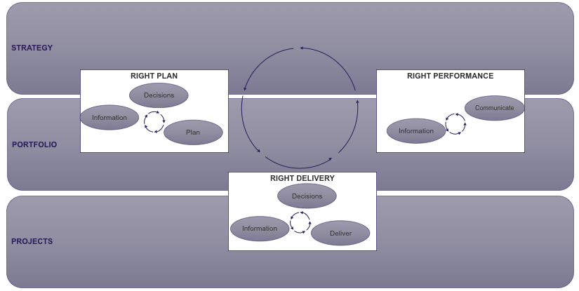

# Selecting, tailoring and deploying a portfolio framework

**[Purpose](#Purpose)** | **[Motivation](#Motivation)** |**[Quick start](#Quick-start)** |

# Purpose
The purpose of this repository is to provide:

1. a starting point for a usable portfolio framework with deployable working practices
2. the knowledge tools to adapt any portfolio framework for a particular business area.

# Motivation
It is helpful to have a practice framework for project portfolio management that meets the needs of the organisation. This sets out how the portfolio is managed. 

There are several excellent standard frameworks to begin from (Praxis, Axelos MoP etc) but they are often quite general. 

It is recommended that your preferred framework is adapted to:

1. reflect how the portfolio is currently managed in reality
2. goes into more detail on working practices
3. is tailored to suit the particular business domain
4. is regularly updated as lessons are learned.

Crucially, by creating your own framework, it can be started small and with only those principles and management tasks that really do add value to your particular portfolio. Starting small is assisted by the modular nature of these tool-sets. Doing a few important portfolio-management tasks is more important than defining many tasks. 

# Quick-start
There is more guidance below. However, if you want to get started quickly, and want to apply methods directly to a particular portfolio, then it may be best to start either with:
[Text-mining with Orange](https://github.com/lawrencerowland/Data-Model-for-Project-Frameworks/tree/master/Project-frameworks-by-using-NLP-in-Orange-Datamining) if you want to break down your business domain straight-away

[Modular Portfolio framework](https://github.com/lawrencerowland/Data-Model-for-Project-Frameworks/tree/master/P3M-content-first-framework) if you want to start selecting some modules straight away that are relevant to your portfolio. 

# Usage

This repository is structured as a series of independent frameworks and tool options, by folder. 

1. **Nuclear project data** is our example of documents from a specific project domain. You will be able to replace them with your own company documents

1. **P3M Content first framework** is a Project, Programme and Portfolio Framework that I prefer to use for standard portfolios, based upon building portfolios in various sectors. 

1. **Orange NLP** folder allows the construction of topic models for your business domain, based upon your own documents, working in No Code environment. The business benefit of this is described in a section immediately below

1.  does the same as Orange NLP, but does it by providing a low code environment using Jupyter notebooks.

3. ***Project Frameworks from Example*** folder shows how to take a Portfolio best practice structure, in this case from hundreds of Wikipedia project pages, and generate an initial portfolio framework hierarchy. This is useful if you have a favourite portfolio management text and you wish to use that to create a portfolio practice framework from it

4. **Related work from others** is useful publicly available material on portfolio frameworks from other people /organisations, which may be useful for reference. 

## Orange data-mining demonstration: natural language processing

We will use it to analyse some project documents. These documents could be client documents at the start of an assignment, or successful proposals that we have written. For client documents the purpose would be to understand what topics and project types are covered within the client, and to start to categorise each document for later use. For our proposals, the purpose would be to understand some of the characteristics of successful proposals and identify documents which are good for answering certain proposal questions. This demonstrates one way of getting started with what is called “natural language processing”. 

We look at which words are used within your documents, and how you can select a word that you are interested in from a word cloud, and then how you can find a list of every way that word is used in your documents, including context. You can then select the best wording you find and save it for later use.

We look for what main topics the documents cover, and which documents cover which topics. Then we look to see if different documents are associated with positive or negative sentiment.

Other things Orange is good for

Orange can also do:

- some types of statistical analysis

- network analysis

- supervised machine learning

- unsupervised machine learning

- model testing and creating ensembles of models.

There are plenty of examples and documentation at their website, as well as example models from within the application.

## Example: Setting up a project management framework in a nuclear context

</a>

### Document clustering and Topic modelling for a project library

From the Regulator's library, We machine-read all the different words in each document, and uncover clusters of similar documents, document outliers, and the main topics covered. 

### Why do this? 
This is a first, simple, project-management application of what is called Natural language processing. Machine-learning now allows us to can analyse words as much as we can numbers. This allows us to work with a client to understand whether what is being worked on within project libraries is the same as what Management thinks it is, or the same as what status reports say. 

### What we would be trying to achieve:

By asking a machine to understand the details of what is in this SharePoint, we gain an overview of every word written about a client. We want to see clusters of similar documents, which is another way of saying: we want to see what detailed sub-folder structure should we apply, to reflect what is actually in the documents. We also want to find unusual documents, different to all the other ones. We also want to see what topics occur frequently across all documents.

### Data:

We took 16 project-management related guidance documents from the Office of Nuclear regulation. 

This can also be applied to Excel, text and PowerPoint files, but it takes more pre-processing. 

### Outcome:  

- We found xx large main document clusters.

- We found several document outliers that look different to all the other documents and would be worth special review. 

- When we knew which clusters were of most interest to the nuclear project managers, then we would analyse that cluster in the same way.

- The model also highlighted the top ten themes across the documentation

- these, we noticed two themes (xx) which would be first topics we would explore with a client, if we were checking the health and balance of the work represented by all the documents. 

### Conclusion for project businesses

As a team gets familiar with these techniques , they can scale up ten thousand and then to a hundred thousand documents. They could apply it to all project documents at a client and so understand their whole portfolio.

The team will be able to combine machine-reading their own assessment of the portfolio issues. 

It is also a natural first step towards being able to write the first draft of a proposal automatically, and towards having chat-bots that can support customers based upon our own project body of knowledge. 

### How it is done

- Extract, transform and load the data: We turned the 16 documents into 16 text documents. We counted how many different words of every type there are in each document.

- Run Unsupervised learning: For document clusters, we identified how similar each document is to each other, and how different, depending on the count of these words per document. 

- For example, two documents that each include the words “risk, issue, challenge, delay” are likely to be similar documents. 

- In addition, an unsupervised machine learning technique called Hierarchical Dirichlet Analysis was applied, which generates a probabilistic model of what the most common topics or themes are across the documents.

- Apply the model: For document clusters, we visualised each cluster and inspected which documents are in which cluster. 

Some documents can be seen as not within any cluster- and these are the document outliers. For topic modelling, we looked at each topic to see which documents and which words are captured per topic. 

We tuned the model until we got the number of clusters and topics that made sense for a first pass from a human perspective. This would then be worked with the client and machine together, down to as much detail as needed in the areas of interest to the  portfolio team.  

## Built With

* [ORANGE](//https://orange.biolab.si/) - Orange Data Mining. Fruitful and fun
* [GENSIM](https://radimrehurek.com/gensim/) - Topic modelling for humans

## Contributing

I welcome any thoughts or contributions. Please raise an issue, or get in touch. 

## Authors
* Lawrence Rowland

## License

This project is licensed under the MIT License - see the [LICENSE.md](LICENSE.md) file for details

## Acknowledgments

* The spirit of the thing is well captured at https://doriantaylor.com/skeleton-organs-circulation-sinew-skin

